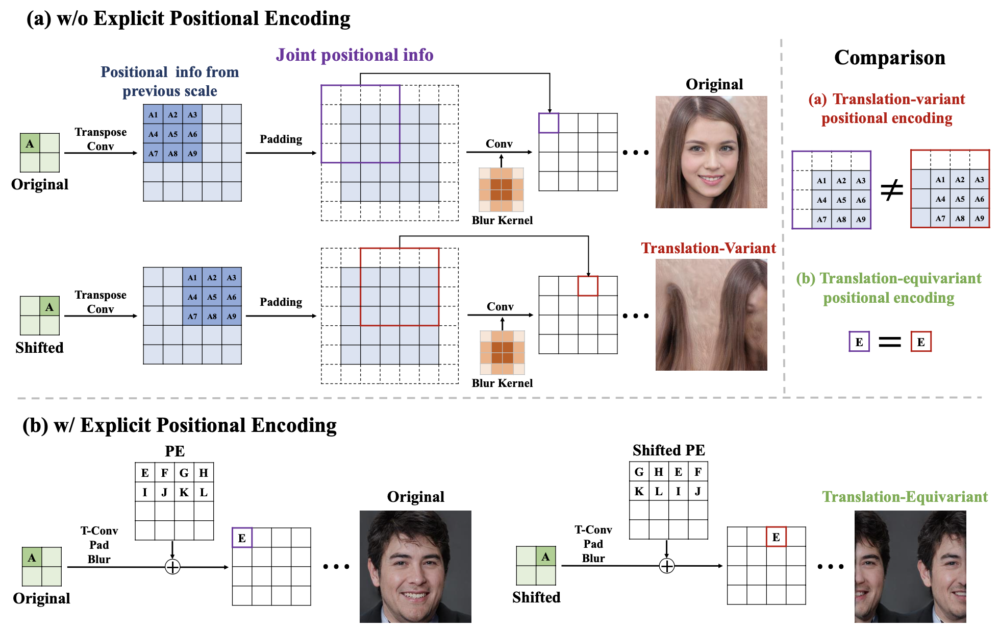

## Spatial unbiased GANs &mdash; Simple TensorFlow Implementation [[Paper]](https://arxiv.org/abs/2108.01285)
### : Toward Spatially Unbiased Generative Models (ICCV 2021)

> **Abstract** *Recent image generation models show remarkable generation performance. However, they mirror strong location preference in datasets, which we call **spatial bias**. Therefore, generators render poor samples at unseen locations and scales. We argue that the generators rely on their implicit positional encoding to render spatial content. From our observations, the generator’s implicit positional encoding is translation-variant, making the generator spatially biased. To address this issue, we propose injecting explicit positional encoding at each scale of the generator. By learning the spatially unbiased generator, we facilitate the robust use of generators in multiple tasks, such as GAN inversion, multi-scale generation, generation of arbitrary sizes and aspect ratios. Furthermore, we show that our method can also be applied to denoising diffusion probabilistic models.*

<div align="center">
  
</div>

## Requirements
* `Tensorflow >= 2.x`

## Usage
```
├── dataset
   └── YOUR_DATASET_NAME
       ├── 000001.jpg 
       ├── 000002.png
       └── ...
```

### Train
```
> python main.py --dataset FFHQ --phase train --img_size 256 --batch_size 4 --n_total_image 6400
```

### Generate Video
```
> python generate_video.py
```

## Results
* **FID: 3.81 (6.4M images, 8GPU, each 4 batch size)**
<div align="center">
  
</div>

## Reference
* [Official Pytorch](https://github.com/jychoi118/toward_spatial_unbiased)
* [StyleGAN2-Tensorflow](https://github.com/moono/stylegan2-tf-2.x)

## Author
[Junho Kim](http://bit.ly/jhkim_resume)
